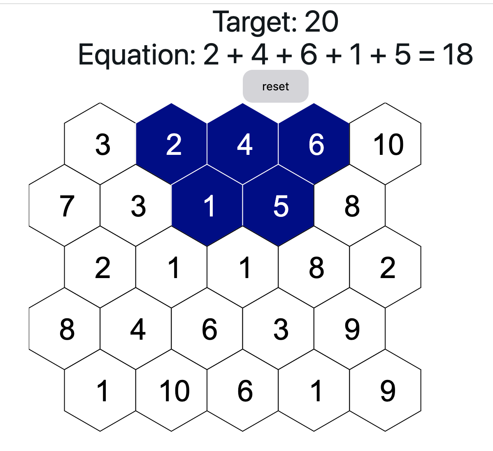

# Hex Math

A simple game on a hex grid to teach basic math to a kid.

## Playing

## New pieces - fade in

## Stack

Contains:

- Vite
- react-ts
- eslint rules around imports
- TailwindCSS
- Github actions to build pages
- NextUI for components
- Konva and react-konva to handle canvas interactions
